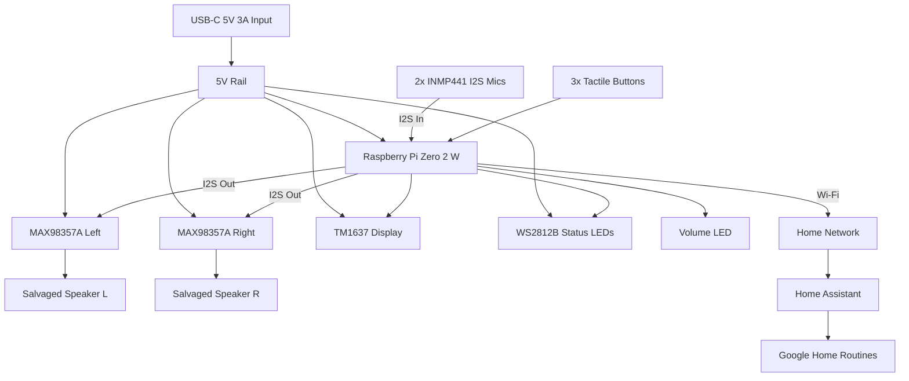

# NS-CSPGASP Speaker Rebuild
**Pi Zero 2 W + Dual MAX98357A I2S Amps + 3D-Printed Enclosure**

> **STATUS UPDATE (January 2026):** The original approach of reusing the NS-CSPGASP enclosure and proprietary display/touch board failed during hardware integration. The project has pivoted to a **fully open hardware design** using only the salvaged speakers.
>
> **See:** [docs/ASSEMBLY_GUIDE.md](docs/ASSEMBLY_GUIDE.md) for the new build instructions.

This plan is the overview. The detailed specs live in the files below and take precedence if anything here disagrees:

| Topic | Source of truth |
|----|----|
| Parts, quantities, costs | [docs/BOM.md](docs/BOM.md) |
| GPIO allocation and wiring | [hardware/schematics/gpio_pinout.md](hardware/schematics/gpio_pinout.md) |
| Build steps | [docs/ASSEMBLY_GUIDE.md](docs/ASSEMBLY_GUIDE.md) |
| Enclosure model and printing | [hardware/enclosure/README.md](hardware/enclosure/README.md) |
| Speaker measurements | [hardware/speaker_specs/measurements.md](hardware/speaker_specs/measurements.md) |
| Pi boot config | [config/config.txt.example](config/config.txt.example) |

---

## Project Pivot: Open Hardware Design

After extensive attempts to reverse-engineer the Condor Top Board (display/touch interface), the original unit failed to boot after ribbon cable splicing. Rather than continue debugging proprietary hardware, this project now uses:

- **Salvaged speakers** from the original NS-CSPGASP (dual 4Ω drivers)
- **New 3D-printed enclosure** designed for proper acoustics
- **Commodity display** (TM1637 7-segment) instead of proprietary LED matrix
- **Simple tactile buttons** instead of capacitive touch
- **RGB status LEDs** (WS2812B) for visual feedback

The earlier reverse-engineering plan (keep the case and Condor Top Board, adapt its FPC ribbon to the Pi) is preserved in git history at commit `a8036e0` and in `insignia_ns_cspgasp_rebuild/`.

### Project Structure

```
hardware/
├── enclosure/          # OpenSCAD 3D models
├── schematics/         # GPIO pinout, wiring diagrams
└── speaker_specs/      # Measurement templates

firmware/
├── display/            # TM1637 and WS2812B drivers
├── controls/           # Button handler
└── main.py             # Main application

docs/
├── BOM.md              # Bill of materials (~$112-120)
└── ASSEMBLY_GUIDE.md   # Step-by-step build instructions

config/
├── config.txt.example  # Raspberry Pi boot config
└── systemd/            # Auto-start service
```

---

## Objective

Replace the obsolete and unreliable Condor (Google Assistant) board with a fully controllable, future-proof system that:

- Retains similar loudness to the original speaker, in stereo
- Supports:
  - Spotify playback
  - Voice control
  - Reliable timers and alarms
- Integrates with Google Home via Home Assistant (no official Assistant dependency)
- ~~Reuses the existing enclosure and speaker~~ → **New enclosure, salvaged speakers only**
- ~~Requires no reverse-engineering of the Condor PCB~~ → **No Condor hardware used**

---

## Current Status

| Area | State |
|----|----|
| BOM | Complete, ready to order |
| GPIO pinout and wiring | Documented |
| Assembly guide | Written (8 phases) |
| Enclosure | Parametric OpenSCAD model written; STL not yet generated |
| Speaker measurements | **Not yet taken.** Enclosure uses estimates (~52 mm diameter) until measured |
| Firmware | Clock display, status LEDs and volume/mute buttons implemented |
| Spotify, voice, timers/alarms | **Not started.** Planned software below |

---

## High-Level Architecture



---

## Design Rationale

### Why the Condor hardware is fully removed
- Main board is locked down with secure boot
- Amp, DAC, DSP, and SoC are tightly integrated with no clean audio input points
- Adapting the Top Board's FPC ribbon was attempted and bricked the unit

A new enclosure costs more but removes every proprietary dependency.

### Why MAX98357A (x2)
- Combines DAC + Class-D amp in one chip
- ~3 W into 4 Ω @ 5 V per channel
- Both share one I2S bus; the SD_MODE pin selects left or right channel
- I2S input avoids analog noise; tiny, cool, inexpensive

### Why Raspberry Pi Zero 2 W (vs. ESP32)
- **Spotify Connect:** `spotifyd` on Linux is reliable; ESP32 relies on fragile reverse-engineered libraries
- **Voice:** enough CPU for local wake-word engines and Wyoming Satellite pipelines
- **Development:** Python on Linux makes hardware iteration fast

### Why I2S MEMS microphones
- Mount inside the enclosure, matching the original's clean look
- Two mics allow beamforming and better noise/echo rejection
- Share the amps' I2S clocks, needing only one extra GPIO (GPIO20)

### Why a 3D-printed enclosure
- Separate sealed chambers for left and right speakers
- PETG for better vibration damping than PLA
- Removable back panel for SD card access and future changes

---

## Bill of Materials

Summary only; see [docs/BOM.md](docs/BOM.md) for part numbers and sources.

| Category | Key Parts | Est. Cost |
|----|----|----:|
| Core electronics | Pi Zero 2 W, 32 GB microSD, 2x MAX98357A, USB-C breakout, 5V 3A PSU, 390kΩ resistor | $45 |
| Voice input | 2x INMP441 I2S mics (alt: SPH0645) | $8-12 |
| Display & LEDs | TM1637 4-digit display, 3-5 WS2812B, 5mm LED + 220Ω | $7 |
| Controls | 3x 6mm tactile buttons | $1 |
| Wiring & hardware | Silicone wire, headers, M2.5 standoffs, M3 heat-set inserts, JST-PH | $23 |
| Acoustic materials | Foam, silicone gasket sheet, polyfill | $18 |
| 3D printing | ~200 g PETG, ~50 g TPU (optional) | $10 |
| Speakers | Salvaged from original unit | $0 |
| **Total** | | **~$112-120** |

---

## Electrical Wiring

Full tables in [hardware/schematics/gpio_pinout.md](hardware/schematics/gpio_pinout.md).

### GPIO Allocation
| GPIO | Pin | Function |
|----|:----:|----|
| GPIO18 | 12 | I2S BCLK (amps + mics) |
| GPIO19 | 35 | I2S LRCLK (amps + mics) |
| GPIO21 | 40 | I2S DOUT → amps |
| GPIO20 | 38 | I2S DIN ← mics |
| GPIO23 | 16 | TM1637 CLK |
| GPIO24 | 18 | TM1637 DIO |
| GPIO10 | 19 | WS2812B DATA |
| GPIO12 | 32 | Volume LED (PWM) |
| GPIO17 | 11 | Button: Volume Up |
| GPIO27 | 13 | Button: Volume Down |
| GPIO22 | 15 | Button: Mute |
| GPIO2/3 | 3/5 | Reserved (I2C expansion) |

### Stereo Amp Channel Selection
| Amp | SD_MODE |
|----|----|
| Left | Direct to VIN (5V) |
| Right | VIN via 390kΩ |

### Power
```
USB-C 5V (3A)
 ├── Pi Zero 2 W        ~300 mA
 ├── MAX98357A x2       ~200 mA each
 ├── TM1637             ~20 mA
 ├── WS2812B            ~60 mA per LED
 └── Volume LED         ~10 mA
Typical ~0.9 A, peak ~1.5 A. All grounds common (star ground at input).
```

### Speaker Output
```
Each MAX SPK+ → Speaker +
Each MAX SPK− → Speaker −
```

Do NOT connect speaker leads to ground.

---

## Build Phases

Details in [docs/ASSEMBLY_GUIDE.md](docs/ASSEMBLY_GUIDE.md).

1. **Speaker extraction:** open the NS-CSPGASP, remove, measure and test the speakers
2. **Pi setup:** flash OS, enable I2S, install dependencies
3. **Audio path:** wire and test one amp, then add the second for stereo
4. **Microphones:** wire, mount and verify the INMP441s
5. **Display and controls:** wire and test TM1637, WS2812B and buttons
6. **Enclosure:** enter speaker measurements in `main_body.scad`, export STL, print in PETG
7. **Final assembly:** solder, mount electronics and speakers, add acoustic treatment, close
8. **Software:** copy firmware, install the systemd service, verify

---

## Software Stack

### Base OS
- Raspberry Pi OS Lite (64-bit)

### Audio
- ALSA + PipeWire
- `/boot/config.txt` (see [config/config.txt.example](config/config.txt.example)):
```
dtparam=audio=off
dtoverlay=hifiberry-dac
```

### Speaker Firmware (implemented)
- `firmware/main.py`, run by `config/systemd/open-speaker.service`
- TM1637 clock, WS2812B status LED, volume/mute buttons with volume LED

### Media (planned)
- spotifyd (Spotify Connect)

### Voice (planned)
- Wyoming Satellite
- Wake word: Porcupine or openWakeWord
- STT: Whisper.cpp
- TTS: Piper

### Automation (planned)
- Home Assistant
- REST / webhook triggers
- Google Home routines via HA

---

## Timers & Alarms (planned)
- Local scheduler (Python or systemd)
- Survives reboots
- Shown on the TM1637 display
- No cloud dependency

---

## Open Issues

- **Speaker dimensions unknown:** measure before printing the enclosure
- **Microphone choice inconsistent:** `docs/BOM.md` and the assembly guide specify internal I2S mics, but `gpio_pinout.md` still recommends a USB mic and the assembly guide's "Next Steps" says to add one
- **Full-duplex I2S unconfirmed:** mics need `googlevoicehat-soundcard`, which `config.txt.example` says replaces `hifiberry-dac`, while the assembly guide adds it alongside. Needs a bench test with both amps and mics

---

## Expected Performance

| Feature | Original | Rebuild |
|----|----|----|
| Max loudness | ~90 dB | ~90 dB |
| Stereo | ✅ | ✅ |
| Alarm reliability | ❌ | ✅ |
| Spotify | ✅ | ✅ |
| Voice control | ❌ | ✅ |
| Future support | ❌ | ✅ |

---

## Known Limits
- No official Google Assistant registration
- Google Home via Home Assistant bridge
- Simpler DSP than Google original
- New enclosure will not match the original's look

---

## Optional Enhancements
- Temperature sensor on the display (I2C pins reserved)
- Custom wake-word sounds
- Aux input port
- Bass port tuning in the enclosure
- Higher-sensitivity speakers
