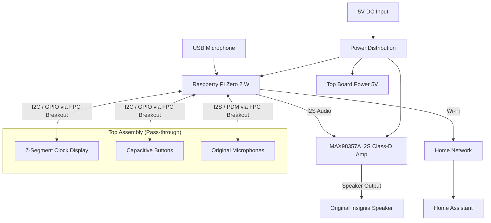
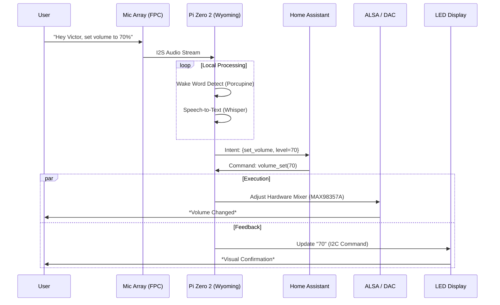

# Insignia NS-CSPGASP Rebuild Plan
**Pi Zero 2 W + MAX98357A + Condor Board Interface**

## Objective

Replace the "Condor" logic board (Google Assistant unit) in the Insignia Voice Smart Speaker with a fully controllable system that:

-   **Retains Functionality:** Uses the original Speaker, Enclosure, and LED Clock Display (future).
-   **Audio Quality:** Matches original loudness via I2S Amp.
-   **Smart Features:** Spotify Connect, Voice Assistant (Local), Home Assistant integration.
-   **No Cloud Lock-in:** Removes dependence on Google's discontinued 3rd party support.
-   **Hardware Reuse:** Reuses the "Condor Touch Board" (Top UI) and "Condor Main Board" chassis mount points.

---

## High-Level Architecture



---

## Design Rationale

### Why the Condor Main Board is removed
-   **Proprietary:** The main "Condor" board is locked down with secure boot.
-   **Audio Quality:** The original DSP and Amp are integrated; driving the speaker directly with a new Amp is easier than reverse-engineering the Condor audio path.

### Why the Condor Top Board (Touch/Display) is kept
-   **Integration:** It contains the clock display and custom mechanical buttons which fit the case perfectly.
-   **Interface:** It connects via a ribbon cable (FPC), which can be adapted to the Pi.

### Why MAX98357A
-   **Power:** Sufficient for the internal 4Ω speaker (likely ~3W).
### Why Raspberry Pi Zero 2 W (vs. ESP32)?
You asked about space and the ESP32. While the ESP32 is smaller and cheaper, the **Pi Zero 2 W is the correct choice** for this specific project because:

1.  **Space is NOT an issue:** The "Condor Main Board" you are removing is massive (approx. 100mm x 60mm). The Pi Zero 2 W (65mm x 30mm) will float in that empty space with plenty of room for the HAT and cables.
2.  **Spotify Connect:** On Linux (Pi), `spotifyd` is a rock-solid, official-grade client. On ESP32, Spotify support is "hacky," relying on reverse-engineered libraries that often break or lack "Connect" features.
3.  **Voice Assistant:** The Pi has the CPU power to run **local wake-word engines** (like Porcupine or openWakeWord) and high-quality audio pipelines (Wyoming Satellite). The ESP32-S3 forces you into a much more constrained "micro" voice ecosystem.
4.  **Display Driver:** Reverse-engineering the LED clock protocol is significantly easier with Python scripts on Linux than compiling C++ firmware for every test on an ESP32.

**Verdict:** The Pi Zero 2 W is the smallest device that still acts like a "real computer," which is required for a reliable Smart Speaker experience.

## Bill of Materials (BOM) & Sourcing Guide

| Component | Description | Search / SKU Examples | Est. Cost |
| :--- | :--- | :--- | :--- |
| **Controller** | **Raspberry Pi Zero 2 W** | • [Adafruit 5291](https://www.adafruit.com/product/5291)<br>• [Pi Hut Zero 2](https://thepihut.com/products/raspberry-pi-zero-2-w) | $15.00 |
| **Interface HAT** | **Raspberry Pi Zero Proto HAT** (Shim style) | • **Adafruit 3203** (Perma-Proto HAT)<br>• **Pimoroni** Zero LiPo Shim (generic proto)<br>• Search: *"Pi Zero Proto HAT"* | $4-6 |
| **Ribbon Breakout** | **20-Pin 0.5mm FPC to DIP Adapter** | • **Adafruit 1492** (Perfect fit)<br>• **Amazon:** *"20 pin 0.5mm FPC breakout board"*<br>• **Uxcell** a14061600ux0766 | $8-10 |
| **Audio Amp** | **MAX98357A I2S Class-D Amp** | • **Adafruit 3006** (Recommended)<br>• **Amazon:** *"MAX98357A Breakout"* | $6.00 |
| **Power Cable** | **JST-PH 2.0mm Cable** (Internal Wiring) | • **Adafruit 261** (JST-PH 2-pin)<br>• **Pololu** JST PH leads<br>(For splicing the internal speaker) | $2.00 |
| **Misc** | Wire, Solder, Double-sided Tape | 24-26 AWG silicon wire | - |

> [!NOTE]
> **Breakout Board Critical Spec:** Ensure the FPC side is **0.5mm pitch** and has **20 pins**. The DIP side will be standard 2.54mm (0.1") pitch to fit the Proto HAT.

---

## Electrical Wiring

> [!WARNING]
> **VERIFY VOLTAGE:** Do not assume the red/black power wires are 5V. Some models use 12V. Measure before connecting Pi!

### Power Distribution
```
DC Input (Verify Voltage!)
 ├── Buck Converter (If 12V) -> 5V
 └── 5V Rail
      ├── Pi Zero 2 W (5V Pin)
      ├── MAX98357A (VIN)
      └── Top Board (Check Pinout for 5V/3V3 reqs)
```

### I2S Audio (Pi → MAX98357A)
| Pi GPIO | Signal | MAX98357A |
|----|----|----|
| GPIO18 | BCLK | BCLK |
| GPIO19 | LRCLK | LRC |
| GPIO21 | DATA | DIN |
| 5V | Power | VIN |
| GND | Ground | GND |

### Top Board Interface (Requires FPC Breakout)
*Pinout TBD based on user verification of FPC cable.*
*Likely I2C for Display/Touch controller.*

### Speaker Output
```
MAX SPK+ → Speaker +
MAX SPK− → Speaker −
```

Do NOT connect speaker leads to ground.

---

## Physical Assembly Steps

1.  **Teardown:** Open case, remove "Condor Main Board".
2.  **Top Board:** Leave "Condor Touch Board" in place.
3.  **Interface:** Connect FPC Breakout to the Touch Board's ribbon cable.
4.  **Audio:** Mount MAX98357A and connect to internal speaker wires.
5.  **Compute:** Mount Pi Zero 2 W (thermal paste recommended if enclosed).
6.  **Power:** Tap into the DC Input jack wires.

---

## Software Stack

### Base OS
- Raspberry Pi OS Lite (64-bit)

### Audio
- ALSA + PipeWire
- Enable I2S in /boot/config.txt:
```
dtoverlay=hifiberry-dac
```

### Media
- spotifyd (Spotify Connect)

### Voice
- Wake word: Porcupine
- STT: Whisper.cpp
- TTS: Piper

### Logical Command Flow
How a voice command travels through the system: "Hey Victor, set volume to 70%".



### Automation
- Home Assistant
- REST / webhook triggers
- Google Home routines via HA

---

## Timers & Alarms
- **Display Driver (In Progress):** Will require reverse engineering the LED commands via the FPC interface.
- Local scheduler (Python or systemd)
- Survives reboots
- No cloud dependency

---

## Expected Performance

| Feature | Original | Rebuild |
|----|----|----|
| Max loudness | ~90 dB | ~90 dB |
| Alarm reliability | ❌ | ✅ |
| Spotify | ✅ | ✅ |
| Voice control | ❌ | ✅ |
| Future support | ❌ | ✅ |

---

## Known Limits
- **Display Driver:** Requires development. Currently, the display will be off until the protocol is reversed.
- No official Google Assistant registration
- Google Home via Home Assistant bridge
- Simpler DSP than Google original

---

## Optional Enhancements
- LED status ring (if separate from Top Board)
- Custom wake-word sounds
- 3D-printed mounting bracket
