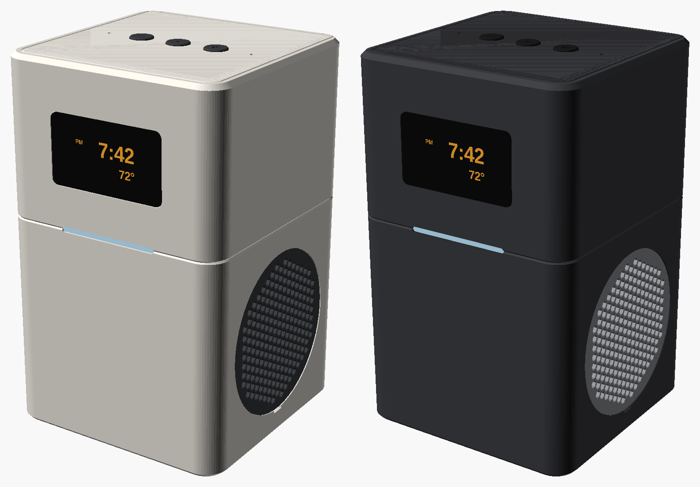

# Open Speaker

**An open-source rebuild of the Insignia NS-CSPGASP smart speaker: a Raspberry Pi
Zero 2 W voice assistant and alarm clock for Home Assistant, with speech
recognition and AI models on your own network.**



Google stopped supporting the NS-CSPGASP's Assistant board, and its hardware is
locked down. This project keeps only the two speaker drivers and replaces
everything else with parts you can buy anywhere, in a 3D-printed enclosure on the
original's footprint.

- **Voice control through Home Assistant**: "Okay Nabu, turn off the kitchen
  lights". Or skip Home Assistant and talk straight to your own servers.
- **Your models, on your network**: Whisper or Speech-to-Phrase for speech
  recognition, Ollama, llama.cpp or any OpenAI-compatible server for the
  conversation, Piper or Kokoro for the voice. Nothing leaves your home unless
  you choose a cloud service.
- **Light enough for a Pi Zero 2 W**: only the wake word (microWakeWord) runs on
  the speaker. Speech recognition runs elsewhere.
- **A clock first**: the display always shows the time and temperature, like the
  original. Timers and alarms run on the speaker, survive reboots and work when
  the network is down.
- **Stereo**, two MAX98357A amplifiers into the original drivers, in a tuned
  bass chamber.
- **Physical buttons** for volume, talk/stop/snooze and microphone mute. Status
  light in the waist.
- **An HTTP API** for Home Assistant automations: announcements, timers, alarms,
  volume.

## How it works

```
 Open Speaker (Pi Zero 2 W)                        your network
 ┌──────────────────────────────┐
 │ 2 × INMP441 mics ─► wake word │   voice    ┌──────────────────────────────┐
 │ (microWakeWord)               │ ─────────► │ Home Assistant Assist pipeline│
 │                               │            │  or your own servers:         │
 │ timers, alarms, volume,       │   reply    │  speech-to-text  (Whisper)    │
 │ stop, snooze: on the speaker  │ ◄───────── │  language model  (Ollama)     │
 │                               │            │  text-to-speech  (Piper)      │
 │ 2 × MAX98357A ─► 2 drivers    │            └──────────────────────────────┘
 │ OLED clock, LEDs, buttons     │ ◄── HTTP API ── Home Assistant automations
 └──────────────────────────────┘
```

## Hardware

| | |
|---|---|
| Computer | Raspberry Pi Zero 2 W |
| Audio out | 2 × MAX98357A I2S class-D amplifiers, 3 W each, into the original 4 Ω drivers |
| Audio in | 2 × INMP441 I2S MEMS microphones, on the same I2S bus |
| Display | 1.3" 128 × 64 OLED (or 2.42" OLED, or a TM1637 7-segment display) |
| Controls | 4 tactile buttons, 3 WS2812B status LEDs |
| Power | 5 V 3 A over USB-C |
| Enclosure | 100 × 100 × 160 mm, PETG, no supports; ported bass chamber |

About $110 in parts: see the [bill of materials](docs/BOM.md).

## Getting started

1. **Build**: [docs/ASSEMBLY_GUIDE.md](docs/ASSEMBLY_GUIDE.md): teardown, wiring,
   testing on the desk, enclosure.
2. **Install** on Raspberry Pi OS Lite (64-bit):

   ```sh
   git clone -b v2 https://github.com/brewer-michael/ns-cspgasp-rebuild.git
   sudo ns-cspgasp-rebuild/scripts/install.sh
   ```

3. **Connect**: [Home Assistant](docs/HOME_ASSISTANT.md), and/or
   [your own speech and AI servers](docs/LOCAL_AI.md). Then
   `sudo open-speaker doctor` checks the whole setup.

## Repository

| Path | |
|---|---|
| [`firmware/`](firmware/) | The `open-speaker` Python package and its tests |
| [`hardware/enclosure/`](hardware/enclosure/) | Parametric OpenSCAD enclosure, export script |
| [`hardware/schematics/gpio_pinout.md`](hardware/schematics/gpio_pinout.md) | Wiring |
| [`hardware/speaker_specs/`](hardware/speaker_specs/) | Measuring the salvaged drivers |
| [`scripts/install.sh`](scripts/install.sh) | Installer for the Pi |
| [`config/`](config/) | ALSA, boot configuration and systemd unit (used by the installer) |
| [`server/`](server/) | Docker Compose for Whisper, Piper and Ollama |
| [`docs/`](docs/) | Build guide, BOM, Home Assistant and local AI guides |
| [`insignia_ns_cspgasp_rebuild/`](insignia_ns_cspgasp_rebuild/) | Archive: the first plan, which reused the original case and display board |

## Status

- **Software**: complete for the features above and covered by unit tests. They
  run against fake audio devices, fake GPIO and fake Home Assistant and Wyoming
  servers.
- **Enclosure**: modelled and checked in OpenSCAD for printability, part
  clearances and assembly order. It hasn't been printed yet, and the driver
  dimensions are estimates from the teardown photos until measured.
- **Electronics**: the wiring follows the parts' datasheets; the full build is
  still to be bench tested.

The background and design decisions are in
[NS-CSPGASP_Rebuild_Plan.md](NS-CSPGASP_Rebuild_Plan.md).

## License

MIT, see [LICENSE](LICENSE).
