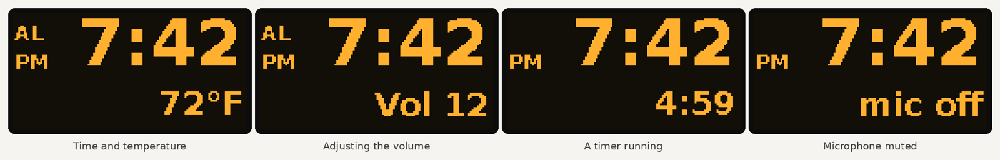

# Build guide

From an Insignia NS-CSPGASP on the bench to a working Open Speaker. Parts are in
[BOM.md](BOM.md), wiring in
[gpio_pinout.md](../hardware/schematics/gpio_pinout.md), and the enclosure in
[hardware/enclosure/README.md](../hardware/enclosure/README.md).

Everything is tested on the desk before it goes into the enclosure.

## 1. Take the drivers out of the original

1. Peel off the rubber feet and remove the screws under them, then release the
   clips around the seam with a plastic pry tool.
2. Inside is a plastic speaker box that holds both drivers, and the Condor boards
   on top of it. Unplug the speaker cables from the main board.
3. Unscrew the halves of the speaker box. The drivers sit in round seats between
   the halves, with rubber rings around them. Lift them out without touching the
   cones. If there's a passive radiator (a flat disc with a rubber surround), keep
   it too.
4. Mark each driver's + terminal (usually red, or a dot or "+" on the frame).

## 2. Measure and test the drivers

Fill in [measurements.md](../hardware/speaker_specs/measurements.md): frame
diameter, cone diameter, the widest part behind the flange, flange thickness and
depth. These go into the enclosure model (step 6).

- Resistance across the terminals: about 3.2 Ω for a 4 Ω driver.
- Polarity: touch a 1.5 V battery to the terminals, + to +. The cone should move
  outwards.

## 3. Set up the Raspberry Pi

1. With [Raspberry Pi Imager](https://www.raspberrypi.com/software/), write
   **Raspberry Pi OS Lite (64-bit)**. In the settings, set the hostname
   (`open-speaker`), your Wi-Fi, a user, SSH and your time zone (the clock uses it).
2. Boot the Pi and log in: `ssh <user>@open-speaker.local`.
3. Install:

   ```sh
   sudo apt install -y git
   git clone -b v2 https://github.com/brewer-michael/ns-cspgasp-rebuild.git
   sudo ns-cspgasp-rebuild/scripts/install.sh
   sudo reboot
   ```

   The installer sets up the sound card, I2C and SPI, installs the software into
   `/opt/open-speaker`, writes `/etc/open-speaker/config.yaml` and a systemd
   service, and turns off Wi-Fi power saving. It is safe to run again to update.

## 4. Test on the desk

Wire everything with jumper wires as in
[gpio_pinout.md](../hardware/schematics/gpio_pinout.md). Power the Pi through the
USB-C breakout, not its own micro-USB port, so the amplifiers get their current
straight from the supply.

**Sound.** Start with one amplifier and one driver:

```sh
aplay -l                                  # the card is "sndrpigooglevoi"
speaker-test -D default -c 2 -t wav -l 1  # says "front left", "front right"
```

Add the second amplifier. With the resistor on the right amp's `SD` pin, measure
`SD` to ground: about 1.0 V (0.77–1.4 V). Then check that each side says its own
name.

**Microphones.**

```sh
sudo open-speaker test-mic --seconds 5    # shows the level while you talk
```

A silent channel usually means a swapped `L/R` pin or a loose `SD` wire.

**Display, LEDs, buttons.** `i2cdetect -y 1` should show the OLED at `3c`. Then
run the full check:

```sh
sudo open-speaker doctor
```

It checks the sound devices, the microphones, the wake word model, the display,
the LEDs, the GPIO pins and every server in the configuration.

## 5. Connect it to Home Assistant and your servers

Follow [HOME_ASSISTANT.md](HOME_ASSISTANT.md) (token, Assist pipeline). To run
without Home Assistant, follow [LOCAL_AI.md](LOCAL_AI.md). Then:

```sh
sudo open-speaker doctor                  # everything OK?
sudo systemctl start open-speaker
journalctl -u open-speaker -f             # watch the log
```

Say **"Okay Nabu"**, wait for the chime, then try "what time is it?" or "set a
timer for one minute".

## 6. Print the enclosure

Enter your driver measurements, export and print:
[hardware/enclosure/README.md](../hardware/enclosure/README.md). Everything prints
in PETG without supports.

## 7. Build it

Follow the assembly order in the
[enclosure README](../hardware/enclosure/README.md#assembly). A few tips:

- Make the wiring harness before you start: the Pi sits on the deck at the
  bottom of the head. The display (front), buttons and microphones (top plate),
  the mute button and USB-C (back panel) need about 12–15 cm of wire each.
  Female jumper housings on the Pi's header make the top plate and back panel
  removable.
- Seal the chamber well: foam tape on the deck ledge and the back frame, and hot
  glue in the deck's wire hole. Leaks make the bass weak and can whistle at the
  port.
- Test again (`sudo open-speaker doctor`) before closing the back panel.

## Using it

| | |
|---|---|
| **Wake word** | "Okay Nabu" (change it in the configuration) |
| **Action button** (top, middle) | Tap: talk, or stop whatever is happening. When an alarm rings: tap to snooze, hold to turn it off |
| **− / +** | Volume; hold to keep changing |
| **Mute** (back) | Microphone off and on. The light turns dim red and the display says "mic off" |

Things the speaker handles itself, even when your server is down:

- "Set a timer for 10 minutes", "set a pasta timer for 8 minutes", "how much time
  is left?", "cancel the timer"
- "Wake me up at 6:30 on weekdays", "set an alarm for 7 am tomorrow", "what alarms
  do I have?", "cancel my alarm"
- "Stop", "snooze", "volume up", "set the volume to 4"

Everything else goes to Home Assistant or your language model: "turn on the
kitchen lights", "is the front door locked?", "how far away is the moon?".

**Display.** It always shows the time and the temperature. The volume, "mic off"
or a timer's countdown take the temperature's place for a moment. "AL" means an
alarm is set. It dims from 22:00 to 07:00.



**Light.** Dim blue: ready. Green: listening. Pulsing cyan: thinking. Pulsing blue: speaking.
Pulsing orange: alarm or timer. Dim red: microphone muted. Red: error.

## Troubleshooting

| Problem | Check |
|---|---|
| No sound card in `aplay -l` | Reboot after installing; `dtoverlay=googlevoicehat-soundcard` in `/boot/firmware/config.txt` |
| Both sides play the same, or one is silent | The `SD` voltages (step 4); left `SD` straight to 5 V |
| Crackles at high volume | Supply too weak, or the amps powered through the Pi's header |
| Microphones silent | `L/R` pins (left to GND, right to 3.3 V); `SD` of both mics to GPIO20 |
| Wake word never triggers | `sudo open-speaker test-mic`: the level should rise clearly when you talk; try `audio.input.gain_db: 10` |
| Wake word triggers by itself | Set `wake.threshold` a little higher |
| OLED blank | `i2cdetect -y 1` shows 3c or 3d? Set `display.oled.address`; the 0.96" type needs `driver: ssd1306` |
| LEDs flicker or show wrong colours | `core_freq=250` in config.txt; the diode or level shifter from the wiring guide |
| "Authentication failed" | The token in `/etc/open-speaker/secrets.env`, then `sudo systemctl restart open-speaker` |
| Slow answers | See "Making it quick" in [LOCAL_AI.md](LOCAL_AI.md#making-it-quick) |
