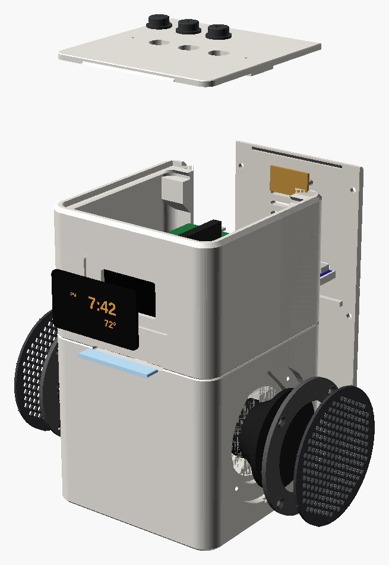
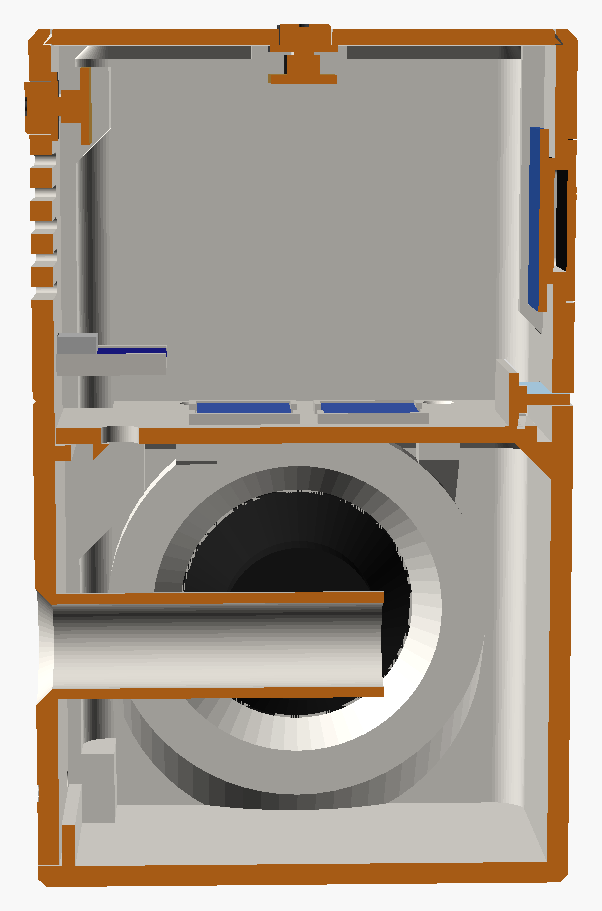
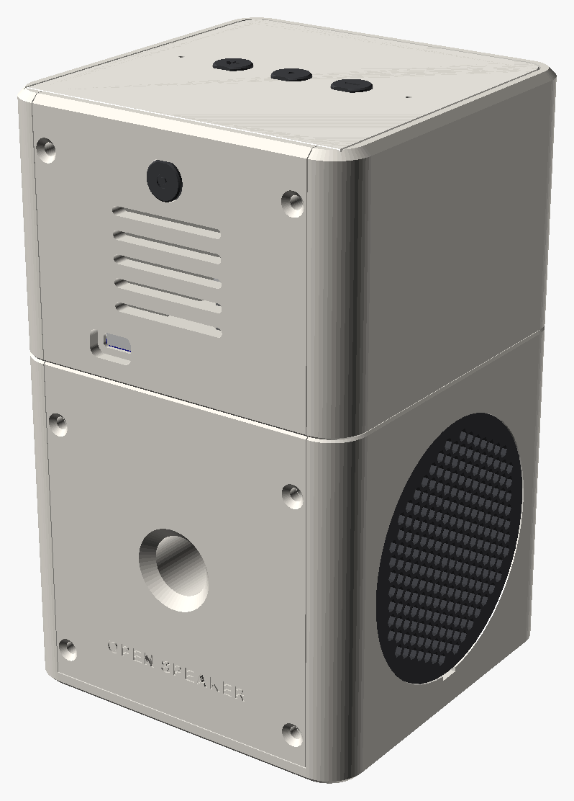
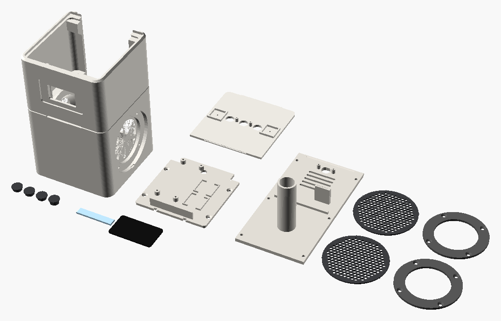

# Enclosure


A 100 × 100 × 160 mm tower, close to the footprint of the NS-CSPGASP it replaces
(96 × 96 × 151.6 mm):

- **Bass chamber** (lower 84 mm): the two salvaged drivers fire left and right
  behind round press-fit grilles. The chamber is tuned by a port in the back panel,
  or uses a passive radiator, or stays sealed.
- **Waist groove** around the body. The status LEDs shine through it at the front
  as a thin line of light.
- **Head**: the clock display sits behind a flush smoked window. The top plate has
  three buttons and two microphones and no visible fasteners.
- **Back panel**: the only screwed-on part. It carries the port, USB-C power and the
  microphone mute button, and it locks the top plate in place. Take it off to reach
  the Pi and its microSD card.

Everything is in [`main_body.scad`](main_body.scad) (OpenSCAD 2021.01 or newer). It
is parametric: the dimensions of your drivers, the display type and the bass
option are all settings at the top of the file.

| Exploded | Section | Back |
|---|---|---|
|  |  |  |

## Before you print: measure the drivers

The driver values in the file are estimates taken from the teardown photos. Take
the drivers out of the original unit, fill in
[`../speaker_specs/measurements.md`](../speaker_specs/measurements.md), then set:

| Parameter | What to measure |
|---|---|
| `speaker_frame_diameter` | Outside diameter of the frame (the flange at the front) |
| `speaker_cone_diameter` | Cone plus rubber surround: the part that moves and must stay uncovered |
| `speaker_basket_diameter` | Widest part *behind* the flange. It passes through the side wall. |
| `speaker_flange_thickness` | Thickness of that front flange |
| `speaker_depth` | Front of the flange to the back of the magnet |
| `speaker_mount` | `clamp` (default): a printed ring clamps the flange, so any round driver works. `holes`: screws go through the frame's own holes. Set `speaker_hole_circle`, `speaker_hole_count` and `speaker_hole_angle` too. |

The model checks itself: OpenSCAD stops with a message if the drivers would hit the
floor, the deck, the port or each other.

Other settings you might change:

| Parameter | Default | Options |
|---|---|---|
| `display_type` | `oled_1_3` | `oled_2_42` (larger window, SSD1309) or `tm1637` (4-digit 7-segment) |
| `bass_mode` | `port` | `passive_radiator` (set `radiator_*` to your radiator) or `sealed` |
| `port_tuning_hz` | 120 | The port length is calculated from the chamber volume |
| `grille_pattern` | `hex` | `rings` |
| `fit` | 0.25 mm | Clearance between printed parts. Raise it if parts bind. |

On every render OpenSCAD prints the chamber volume and the port length, e.g.
`Port: 16 mm x 65 mm, tuned to ~120 Hz`.

## Export

```sh
./export.sh                                   # STLs into ./stl
./export.sh -D speaker_frame_diameter=53      # with your measurements, no file edits
./export.sh --images                          # also refresh docs/images/enclosure-*.png
```

Or open `main_body.scad` in OpenSCAD, choose a part in the Customizer, then render
(F6) and export.

## Printed parts

PETG throughout: it is tougher and damps vibration better than PLA. Use 0.2 mm
layers, 4 perimeters and 40% gyroid infill. **No supports are needed.** Overhangs
are 45 degrees or less, and horizontal holes have pointed or bridged tops.



| Part | Qty | Orientation | Notes |
|---|:-:|---|---|
| `body` | 1 | Upright, bottom on the bed | ~300 g, needs 160 mm of Z height. Enable bridging: the tops of the display opening and light slot are bridges. |
| `back_panel` | 1 | Outside face down | Port tube, USB-C shelf and mute button bosses point up |
| `deck` | 1 | As exported | Chamber lid; carries the Pi, the amplifiers and the LED strip |
| `top_plate` | 1 | Upside down (exported that way) | The bed texture becomes the top surface |
| `grille` | 2 | Outside face down | Crush ribs on the rim make it a press fit |
| `clamp_ring` | 2 | Countersinks up | Not needed with `speaker_mount = "holes"` |
| `caps` | 1 set | Tops on the bed (exported that way) | −, •, + for the top and ○ for mic mute. D-shaped so they can't turn. |
| `diffuser` | 1 | Flat | **White or natural** PETG: carries the LED light to the slot |
| `window` | optional | Flat | Only if you can't get acrylic (see below) |
| `port_plug` | optional | Flange down | Turns a ported back panel into a sealed box |

About 450 g of filament in total.

## Other parts

Links and prices are in the [bill of materials](../../docs/BOM.md).

| Item | Qty | Use |
|---|:-:|---|
| M3 brass heat-set inserts, 5.7 mm long (ruthex), in 4.0 mm holes | 6 | Back panel pillars |
| M3 × 8 countersunk hex socket (ISO 10642) | 6 | Back panel |
| M3 × 8 countersunk | 8 | Clamp rings. They cut their own thread in the side walls. |
| M3 × 10 countersunk | 4 | Deck to the side blocks (self-tapping) |
| M2.6 × 6 self-tapping pan head, or M2.5 × 6 | 4 | Pi Zero 2 W to the deck standoffs |
| M2 × 6 self-tapping | 4 | Switch boards (top plate and back panel) |
| Omron B3F-1000 tactile switches, 6 × 6 mm | 4 | Through-hole, 4.3 mm from the board to the top of the plunger (`switch_height`) |
| Perfboard, 2.54 mm pitch | 50 × 12 mm and 24 × 14 mm | The three top switches sit 7 holes apart |
| Smoked acrylic, 1/16" (1.5–1.6 mm) | 51.5 × 29.5 mm, 2.75 mm corners | Display window (68 × 40 for the 2.42" OLED). Set `window_thickness` to your sheet's thickness. |
| Closed-cell foam tape, 1 mm thick, 5–6 mm wide | ~1 m | Seals the chamber: deck ledge, back frame, panel rib, behind the driver flanges |
| 3M Bumpon SJ5312 feet, 12.7 × 3.6 mm | 4 | Recesses in the bottom |
| Polyester fibre fill | a handful | Loosely in the chamber |

**Display window.** A laser-cutting service or a local makerspace can cut the
acrylic. You can also score it with a knife, snap it and file the corners. Behind
smoked acrylic the display disappears when it is dark, like the original's. If you
have to print the window instead, set `window_thickness = 1.2` and print it in clear
PETG at 100% infill. The digits will look softer.

## Assembly

The clearances between all the parts have been checked in the model, and so have
the paths the deck and the display take on their way in.

1. **Inserts.** Press the six M3 inserts into the pillars beside the back opening
   (soldering iron at about 220 °C).
2. **Deck.** Screw the Pi to the standoffs with the microSD slot facing the back.
   Fix the amplifiers in their cradles with a dab of hot glue and stick the 3-LED
   strip to the fin, LEDs facing forward. Thread two pairs of speaker wire (~15 cm)
   down through the wire hole. Run foam tape along the top of the chamber ledge.
   Lower the deck into the body and fix it with 4 × M3 × 10. Seal the wire hole
   with hot glue.
3. **Display.** Solder the wires on, then slide the module down its rails from the
   top, glass facing the window. Press the acrylic window into its recess from the
   front. A few dots of E6000 on the recess floor, clear of the display area, hold
   it.
4. **Light.** Push the diffuser into the slot from the front until it touches the
   LEDs. Its front face sits 0.6 mm back, in the waist groove. A drop of glue holds it.
5. **Drivers.** Reach through each side opening and pull out that side's wire pair.
   Solder it to the driver, red to +. Put a loose handful of fibre fill into the
   chamber. Set the driver into its seat with a foam ring behind the flange. Fit
   the clamp ring (4 × M3 × 8), then press the grille on. To take a grille off
   again, lever it out at the notch underneath.
6. **Top plate.** Drop the caps into their holes. Screw the switch strip onto the
   two bosses (2 × M2 × 6). Glue the INMP441 boards into their pockets with the
   sound hole over the port; a small foam ring around the port seals it. Wire
   everything to the Pi. Slide the plate's front tongue into the groove behind the
   front wall, then lower the back of the plate.
7. **Back panel.** Glue the USB-C breakout onto its shelf, receptacle against the
   panel. Screw on the mute switch board with its cap. Run foam tape along the
   body's frame beside and below the chamber opening, and along the panel's rib.
   Slide the panel in: its groove catches the top plate's rear tongue and its rib
   slides under the deck. Fix it with 6 × M3 × 8.
8. **Feet.** Stick the four bumpers into the recesses underneath.

Wiring is in [`../schematics/gpio_pinout.md`](../schematics/gpio_pinout.md). The
complete build, from the teardown to software, is in
[`../../docs/ASSEMBLY_GUIDE.md`](../../docs/ASSEMBLY_GUIDE.md).

## Design notes

- **Why the drivers mount from outside.** The original's drivers are clamped
  between the halves of its plastic box. They may have no screw holes, so the
  default mount clamps the flange with a ring and fits any round driver. The seat
  behind the flange flares out at 45 degrees, so the back of the cone is never boxed
  in, and the flare prints without support.
- **One shared chamber** for both drivers, about 0.54 L net. The earlier plan
  divided it. A single tuned volume gives more bass from drivers this small, and at
  low frequencies both drivers play the same signal anyway.
- **Airtight where it matters.** The chamber leaks only through the port. The deck
  seals on a 7 mm ledge; the back panel seals on foam tape below the deck line.
  Above the deck line, the panel's frame is the hard stop that sets how far the
  foam compresses.
- **No visible fasteners on the front, sides or top.** Screws hide under the
  grilles, and the top plate is held by tongues. The six countersunk screws are all
  on the back.
- **Heat.** The Pi Zero 2 W sits on the deck under the vents in the back panel. The
  vents open into the head, which is sealed off from the chamber.
